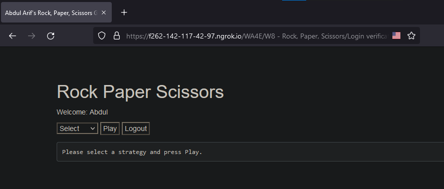

# Login verification - Rock Paper Scissors
## Specifications of each file
These are according to the guidelines given in the WA4E in coursera.
### Entry page - [index.php](rps/index.php)
When you first come to the application (index.php) you are told to go to a login screen. These three components will be present once we enter the game.Attempting to get into game without login pops up iwth a message.


### Login page - [login.php](rps/login.php)
The login screen has error checking on its input data. If either the name or the
password field is blank, a message of this form shows up:

If the password is non-blank and incorrect, message comes in the form of:

If there are errors, it comes back to the login screen (login.php) and shows the error
with blank input fields (i.e. doesn't carry over the values for name="who" and name="pass" fields
from the previous post).

I used a "salted hash" for the password. The "plaintext" of the password is not
present in the application source code except in comments. I used the following values for the salt and stored hash:
```php
$salt = 'XyZzy12*_';
$stored_hash = '1a52e17fa899cf40fb04cfc42e6352f1';  // Pw is php123
```
The stored_hash is the MD5 of the salt concatenated with the plaintext of php123 - which is the password. This is computed using the following PHP:
```php
$md5 = hash('md5', 'XyZzy12*_php123');
```
In order to check an incoming password I concatenated the salt plus password together and
then run that through the hash() function and compared it to the stored_hash.

If the incoming password, properly hashed matches the saved stored_hash value, the user's browser
is redirected to the game.php page with the user's name as a GET parameter using:
```php
header("Location: game.php?name=".urlencode($_POST['who']));
```

### Gaming Area - [game.php](rps/game.php)
In order to protect the game from being played without the user properly logging in, the <b>game.php</b> first
checks the session to see if the user's name is set and if the user's name is not set in the session
the game.php stops immediately using the PHP die() function:
```php
die("Name parameter missing");
```
To test, navigate to game.php manually without logging in - it fails with - "Name parameter missing".

If the user is logged in, they are presented with a drop-down menu showing the options Rock, Paper, Scissors,
and Test as well as buttons labeled "Play" and "Logout".

If the Logout button is pressed the user is redirected back to the index.php page using:
```php
header('Location: index.php');
```
If the user selects, Rock, Paper, or Scissors and presses "Play", the game chooses random computer throw, and scores the game and prints out the result of the game as:
```html
Your Play=Paper Computer Play=Paper Result=Tie
````
The computation whether the user wins, loses, or ties is done by a function named check() that returns a string telling the user what happened:
```php
// This function takes as its input the computer and human play
// and returns "Tie", "You Lose", "You Win" depending on play
// where "You" is the human being addressed by the computer
function check($computer, $human) {
    ...
        return "Tie";
    ...
        return "You Win";
    ...
        return "You Lose";
    ...
}
```
The "Test" option requirements : two nested for loops that tests all combinations of possible human and computer play combinations:
```php
for($c=0;$c<3;$c++) {
    for($h=0;$h<3;$h++) {
        $r = check($c, $h);
        print "Human=$names[$h] Computer=$names[$c] Result=$r\n";
    }
}
```
The $names variable contains the strings "Rock", "Paper", and "Scissors" in this example. The output of this looks as follows:

This will allow us to make sure that the check() function properly handles all combinations of the possible plays without having to play for a long time as the computer makes random plays. 

07-Computer-Picks-Random